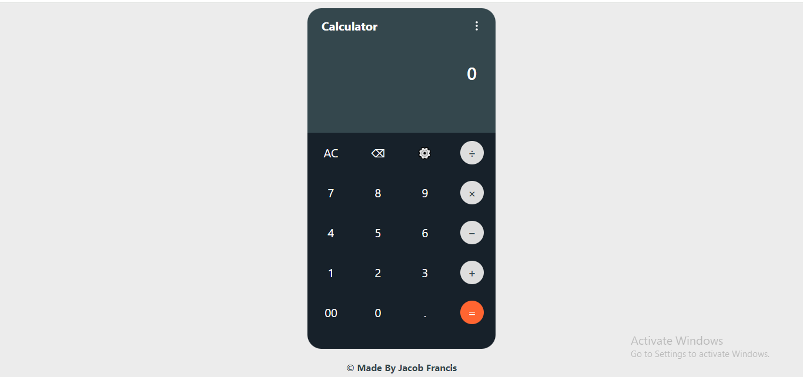

# Javascript Calculator Built With HTML5, Tailwind CSS And Vanilla Javascript. 
This is a simple calculator built using JavaScript. The calculator performs basic arithmetic operations like addition, subtraction, multiplication, and division.

## Table of contents

- [Overview](#overview)
  - [Screenshot](#screenshot)
  - [Links](#links)
- [My process](#my-process)
  - [Built with](#built-with)
- [Author](#author)

## Overview

### Screenshot 📷

### Links

- Live Site URL: [Javascript Calculator](https://javascript-calculator-jacob.netlify.app/)

## My process

### Built with

- Semantic HTML5 markup
- Tailwind CSS
- Vanilla Javascript

## Author

- Github - [ Francis Jacob](https://github.com/Jacbfrancis)
- Twitter - [@jacobxavier_](https://twitter.com/jacobxavier_)
